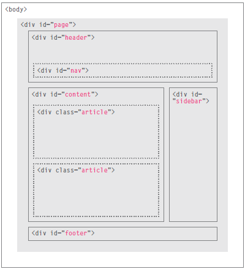

# Read1

## HTML:
###### All websites use HTML and CSS, but content management systems, blogging software, and e-commerce platforms often add a few more technologies into the mix.
- HTMl main content:
 < html >
< head >
< title >This is the Title of the Page< /title >
< /head >
< body >
< h1 >This is the Body of the Page< /h1 >
< p>Anything within the body of a web page is
displayed in the main browser window.< /p>
< /body>
< /html>

* DOCTYPES tell browsers which version of HTML you
are using.

* You can add comments to your code between the
< !-- and --  > markers.

* The id and class attributes allow you to identify
particular elements.

* The < div> and < span> elements allow you to group
block-level and inline elements together.

* < iframes > cut windows into your web pages through
which other pages can be displayed.

* The < meta> tag allows you to supply all kinds of
information about your web page.

* block elements are < h1>, < p>, < ul>, and < li>.

* inline elements are < a>, < b>, < em>, and < img>.

* Escape characters are used to include special
characters in your pages such as <, >, and ©.

* The most common reason why people use < span> elements is so that they can control the appearance of the content of these elements using CSS.

<h5> HTML5 Layout: </h5>

* The < header > and < footer> elements can be used for: ●● The main header or footer that appears at the top or bottom of every page on the site. ●● A header or footer for an individual < article> or < section> within the page.

* The < nav> element is used to contain the major navigational blocks on the site such as the primary site navigation.

* The < nav> element is used to contain the major navigational blocks on the site such as the primary site navigation.

* The < article > element acts as a container for any section of a page that could stand alone and potentially be syndicated.

* The < aside> element has two purposes, depending on whether it is inside an < article> element or not. When the < aside> element is used inside an < article> element, it should contain information that is related to the article but not essential to its overall meaning.When the < aside> element is used outside of an < article> element, it acts as a container for content that is related to the entire page .

* The < section> element groups related content together, and typically each section would have its own heading.

* The purpose of the < hgroup> element is to group together a set of one or more < h1> through < h6> elements so that they are treated as one single heading.

* HTML5 allows web page authors to place an < a> element around a block level element that contains child elements. This allows you to turn an entire block into a link.

### CSS :

* take ideas about your ausiance and why they will visit your website.

* Site maps allow you to plan the structure of a site.

* Wireframes allow you to organize the information that
will need to go on each page.

* Design is about communication. Visual hierarchy helps
visitors understand what you are trying to tell them.

* You can differentiate between pieces of information
using size, color, and style.

* You can use grouping and similarity to help simplify
the information you present

### Javascript:

* A script is a series of instructions that a computer can follow to achieve a goal.

* To approach writing a script, break down your goal into
a series of tasks and then work out each step needed
to complete that task (a flowchart can help).

* The HTML < script> element is used in HTML pages
to tell the browser to load the JavaScript file (rather like the < link> element can be used to load a CSS file).

