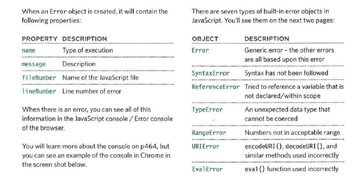

# Read10
## Error Handling & Debugging
- When writing a long script, nobody gets everything right in their first attempt. The error messages that a browser gives look cryptic at first, but they can help you determine what went wrong in your JavaScript and how to fix it.
- To find the source of an error, it helps to know how scripts are processed.The order in which statements are executed can be complex; some tasks cannot complete until another statement or function has been run.
- The JavaScript interpreter uses the concept of execution contexts.There is one global execution context; plus, each function creates a new execution context. They correspond to variable scope.
- the JavaScript interpreter processes one line of code at a time. when a statement needs data from another function, it stacks (or piles) the new function on top of the current task.
- In the interpreter, each execution context has its own va ri ables object.It holds the variables, functions, and parameters available within it. Each execution context can also access its parent's v a ri ables object.
- If you are anticipating that something in your code may cause an error, you can use a set of statements to handle the error.This is important because if the error is not handled,the script will just stop processing and the user will not know why. So exception-handling code should inform users when there is a problem.
- Error objects can help you find where your mistakes are and browsers have tools to help you read them.
 

 - Now that you know what an error is and how the browser treats them,there are two things you can do with the errors.
 1. DEBUG THE SCRIPT TO FIX ERRORS.
 2. HANDLE ERRORS GRACEFULLY.
 - Debugging is about deduction: eliminating potential causes of an error.
 WHERE IS THE PROBLEM?
 WHAT EXACTLY IS THE PROBLEM?
 - The JavaScript console will tell you when there is a problem with a script,where to look for the problem, and what kind of issue it seems to be.
 - The JavaScript console is just one of several developer tools that are found in all modern browsers.
1. The Console option is selected.
2. The type of error and the error message are shown in red.
3. The file name and the line number are shown on the right-hand side of the console.
- 1. console. info() can be used for general information.
2. console.warn() can be used for warnings.
3. console .error () can be used to hold errors.
- In browsers that support it, the console. table () method lets you output a table showing:
• objects
• arrays that contain other objects or arrays.
- Using the console. assert() method, you can test if a condition is met, and write to the console only if the expression evaluates to false.
- You can indicate that a breakpoint should be triggered only if a condition that you specify is met. The condition can use existing variables.
- the try statement throws an error (because the data cannot be parsed), the code in the catch code block will be run, and the error will not prevent the rest of the script from being executed.
- The catch statement creates a message using the name and message properties of the Error object.
- the finally statement adds a link that allows users to refresh the data they are seeing.
- If you try to use a string in a mathematical operation (other than in addition), you do not get an error, you get a special value called NaN (not a number).
<address>Sources: javascript book.</address>