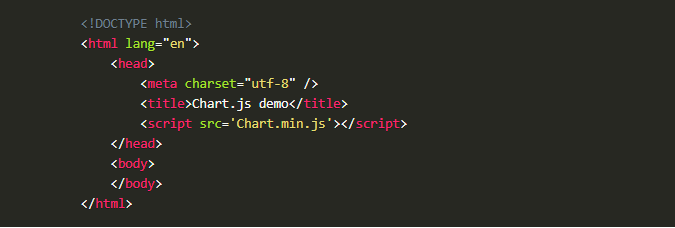
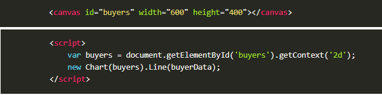
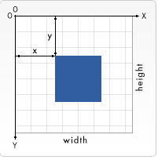

# Read12
##  Chart.js
- Charts are far better for displaying data visually than tables and have the added benefit that no one is ever going to press-gang them into use as a layout tool. They’re easier to look at and convey data quickly, but they’re not always easy to create.
- A great way to get started with charts is with Chart.js, a JavaScript plugin that uses HTML5’s canvas element to draw the graph onto the page. It’s a well documented plugin that makes using all kinds of bar charts, line charts, pie charts and more, incredibly easy.
- Setting :
The first thing we need to do is download Chart.js. Copy the Chart.min.js out of the unzipped folder and into the directory you’ll be working in. Then create a new html page and import the script:

- Drawing a line chart:
To draw a line chart, the first thing we need to do is create a canvas element in our HTML in which [Chart.js](https://www.chartjs.org/docs/latest/getting-started/) can draw our chart. So add this to the body of our HTML page.
- It's easy to get started with Chart.js. All that's required is the script included in your page along with a single < canvas> node to render the chart.
- we need to write a script that will retrieve the context of the canvas, so add this to the foot of your body element.

- pass some options to the chart via the Line method or Inside the same script tags we need to create our data.

[ArticleSource](https://www.webdesignerdepot.com/2013/11/easily-create-stunning-animated-charts-with-chart-js/)

## Canvas

- < canvas> looks like the < img> element, with the only clear difference being that it doesn't have the src and alt attributes. Indeed, the < canvas> element has only two attributes, width and height. These are both optional and can also be set using DOM properties.
- When no width and height attributes are specified, the canvas will initially be 300 pixels wide and 150 pixels high.
- The element can be sized arbitrarily by CSS, but during rendering the image is scaled to fit its layout size: if the CSS sizing doesn't respect the ratio of the initial canvas, it will appear distorted.
- Providing fallback content is very straightforward: just insert the alternate content inside the < canvas> element. Browsers that don't support < canvas> will ignore the container and render the fallback content inside it. Browsers that do support < canvas> will ignore the content inside the container, and just render the canvas normally.
- The fallback content is displayed in browsers which do not support < canvas>. Scripts can also check for support programmatically by testing for the presence of the getContext() method. 
[ArticleSource1](https://developer.mozilla.org/en-US/docs/Web/API/Canvas_API/Tutorial/Basic_usage)

- the canvas grid or coordinate space. Our HTML skeleton from the previous page had a canvas element 150 pixels wide and 150 pixels high.see this canvas with the default grid overlayed. Normally 1 unit in the grid corresponds to 1 pixel on the canvas. The origin of this grid is positioned in the top left corner at coordinate (0,0). All elements are placed relative to this origin. So the position of the top left corner of the blue square becomes x pixels from the left and y pixels from the top, at coordinate (x,y). Later in this tutorial we'll see how we can translate the origin to a different position, rotate the grid and even scale it, but for now we'll stick to the default.

- < canvas> only supports two primitive shapes: rectangles and paths (lists of points connected by lines). All other shapes must be created by combining one or more paths. Luckily, we have an assortment of path drawing functions which make it possible to compose very complex shapes.

- the rectangle: There are three functions that draw rectangles on the canvas:
1. (x, y, width, height)
Draws a filled rectangle.
2. strokeRect(x, y, width, height)
Draws a rectangular outline.
3. clearRect(x, y, width, height)
Clears the specified rectangular area, making it fully transparent.
Each of these three functions takes the same parameters. x and y specify the position on the canvas (relative to the origin) of the top-left corner of the rectangle. width and height provide the rectangle's size. 
-  A path is a list of points, connected by segments of lines that can be of different shapes, curved or not, of different width and of different color. A path, or even a subpath, can be closed. To make shapes using paths, we take some extra steps:

1. beginPath(): Creates a new path. Once created, future drawing commands are directed into the path and used to build the path up.
2. Path methods: Methods to set different paths for objects.
3. closePath(): Adds a straight line to the path, going to the start of the current sub-path.
4. stroke(): Draws the shape by stroking its outline.
5. fill(): Draws a solid shape by filling the path's content area.
- call the beginPath(). Internally, paths are stored as a list of sub-paths (lines, arcs, etc) which together form a shape. Every time this method is called, the list is reset and we can start drawing new shapes.
[ArticleSource2](https://developer.mozilla.org/en-US/docs/Web/API/Canvas_API/Tutorial/Drawing_shapes)
- Apply colors to a shape, there are two important properties we can use:
1. fillStyle = color
Sets the style used when filling shapes.
2. strokeStyle = color
Sets the style for shapes' outlines.
- globalAlpha = transparencyValue
Applies the specified transparency value to all future shapes drawn on the canvas. The value must be between 0.0 (fully transparent) to 1.0 (fully opaque). This value is 1.0 (fully opaque) by default.
- The rgba() function is similar to the rgb() function but it has one extra parameter. The last parameter sets the transparency value of this particular color. The valid range is again between 0.0 (fully transparent) and 1.0 (fully opaque).

#### Line styles
There are several properties which allow us to style lines: 

1. lineWidth = value
Sets the width of lines drawn in the future.
2. lineCap = type
Sets the appearance of the ends of lines.
3. lineJoin = type
Sets the appearance of the "corners" where lines meet.
4. miterLimit = value
Establishes a limit on the miter when two lines join at a sharp angle, to let you control how thick the junction becomes.
5. getLineDash()
Returns the current line dash pattern array containing an even number of non-negative numbers.
setLineDash(segments)
Sets the current line dash pattern.
6. lineDashOffset = value
Specifies where to start a dash array on a line.

- There are three possible values for this property: round, bevel and miter. By default this property is set to miter. Note that the lineJoin setting has no effect if the two connected segments have the same direction, because no joining area will be added in this case.
- The setLineDash method and the lineDashOffset property specify the dash pattern for lines. The setLineDash method accepts a list of numbers that specifies distances to alternately draw a line and a gap and the lineDashOffset property sets an offset where to start the pattern.
- We create a CanvasGradient object by using one of the following methods. We can then assign this object to the fillStyle or strokeStyle properties :
1. createLinearGradient(x1, y1, x2, y2)
Creates a linear gradient object with a starting point of (x1, y1) and an end point of (x2, y2).
2. createRadialGradient(x1, y1, r1, x2, y2, r2)
Creates a radial gradient. The parameters represent two circles, one with its center at (x1, y1) and a radius of r1, and the other with its center at (x2, y2) with a radius of r2.
3. createConicGradient(angle, x, y)
Creates a conic gradient object with a starting angle of angle in radians, at the position (x, y).
- gradient.addColorStop(position, color)
Creates a new color stop on the gradient object. The position is a number between 0.0 and 1.0 and defines the relative position of the color in the gradient, and the color argument must be a string representing a CSS < color>, indicating the color the gradient should reach at that offset into the transition.
- createPattern(image, type):Creates and returns a new canvas pattern object. image is a CanvasImageSource (that is, an HTMLImageElement, another canvas, a < video> element, or the like. type is a string indicating how to use the image.
1. repeat
Tiles the image in both vertical and horizontal directions.
2. repeat-x
Tiles the image horizontally but not vertically.
3. repeat-y
Tiles the image vertically but not horizontally.
4. no-repeat
Doesn't tile the image. It's used only once.
- shadowOffsetX = float
Indicates the horizontal distance the shadow should extend from the object. This value isn't affected by the transformation matrix. The default is 0.
- shadowOffsetY = float
Indicates the vertical distance the shadow should extend from the object. This value isn't affected by the transformation matrix. The default is 0.
- shadowBlur = float
Indicates the size of the blurring effect; this value doesn't correspond to a number of pixels and is not affected by the current transformation matrix. The default value is 0.
- shadowColor = color
A standard CSS color value indicating the color of the shadow effect; by default, it is fully-transparent black.
- When using fill (or clip and isPointInPath) you can optionally provide a fill rule algorithm by which to determine if a point is inside or outside a path and thus if it gets filled or not. This is useful when a path intersects itself or is nested.
- 
[ArticleSource3](https://developer.mozilla.org/en-US/docs/Web/API/Canvas_API/Tutorial/Applying_styles_and_colors)

- The canvas rendering context provides two methods to render text:

1. fillText(text, x, y [, maxWidth]): Fills a given text at the given (x,y) position. Optionally with a maximum width to draw.
2. strokeText(text, x, y [, maxWidth]): Strokes a given text at the given (x,y) position. Optionally with a maximum width to draw.
- font = value
The current text style being used when drawing text. This string uses the same syntax as the CSS font property. The default font is 10px sans-serif.
- textAlign = value
Text alignment setting. Possible values: start, end, left, right or center. The default value is start.
- textBaseline = value
Baseline alignment setting. Possible values: top, hanging, middle, alphabetic, ideographic, bottom. The default value is alphabetic.
- direction = value
Directionality. Possible values: ltr, rtl, inherit. The default value is inherit.
- measureText()
Returns a TextMetrics object containing the width, in pixels, that the specified text will be when drawn in the current text style.

[ArticleSource4](https://developer.mozilla.org/en-US/docs/Web/API/Canvas_API/Tutorial/Drawing_text)