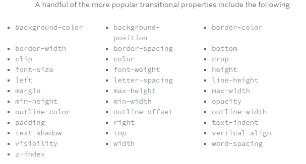

# Read14a

## Transforms

- Transform Syntax: The actual syntax for the transform property is quite simple, including the transform property followed by the value. The value specifies the transform type followed by a specific amount inside parentheses.
- 2D Transforms: lements may be distorted, or transformed, on both a two-dimensional plane or a three-dimensional plane. Two-dimensional transforms work on the x and y axes, known as horizontal and vertical axes. Three-dimensional transforms work on both the x and y axes, as well as the z axis. These three-dimensional transforms help define not only the length and width of an element, but also the depth. We’ll start by discussing how to transform elements on a two-dimensional plane, and then work our way into three-dimensional transforms.
- 2D Rotate: The rotate value provides the ability to rotate an element from 0 to 360 degrees. 
- 2D Scale:Using the scale value within the transform property allows you to change the appeared size of an element. The default scale value is 1, therefore any value between .99 and .01 makes an element appear smaller while any value greater than or equal to 1.01 makes an element appear larger.
- 2D Translate: The translate value works a bit like that of relative positioning, pushing and pulling an element in different directions without interrupting the normal flow of the document. Using the translateX value will change the position of an element on the horizontal axis while using the translateY value will change the position of an element on the vertical axis.
- 2D Skew: The last transform value in the group, skew, is used to distort elements on the horizontal axis, vertical axis, or both. The syntax is very similar to that of the scale and translate values. Using the skewX value distorts an element on the horizontal axis while the skewY value distorts an element on the vertical axis. To distort an element on both axes the skew value is used, declaring the x axis value first, followed by a comma, and then the y axis value.%p
- Behind every transform there is also a matrix explicitly defining the behavior of the transform. Using the rotate, scale, transition, and skew values provide an easy way to establish this matrix. However, should you be mathematically inclined, and prefer to take a deeper dive into transforms, try your hand at using the matrix property.
- The transform-origin property can accept one or two values. When only one value is specified, that value is used for both the horizontal and vertical axes. If two values are specified, the first is used for the horizontal axis and the second is used for the vertical axis.
- The perspective of an element can be set in two different ways. One way includes using the perspective value within the transform property on individual elements, while the other includes using the perspective property on the parent element residing over child elements being transformed.
- The perspective value can be set as none or a length measurement. The none value turns off any perspective, while the length value will set the depth of the perspective. The higher the value, the further away the perspective appears, thus creating a fairly low intensity perspective and a small three-dimensional change. The lower the value the closer the perspective appears, thus creating a high intensity perspective and a large three-dimensional change.
- perspective-origin property, and maintain the same relationship to the element. The large difference between the two falls where the origin of a transform determines the coordinates used to calculate the change of a transform, while the origin of a perspective identifies the coordinates of the vanishing point of a transform.
- 3D rotate: Using the rotateX value allows you to rotate an element around the x axis, as if it were being bent in half horizontally. Using the rotateY value allows you to rotate an element around the y axis, as if it were being bent in half vertically. Lastly, using the rotateZ value allows an element to be rotated around the z axis.
- 3D scale: By using the scaleZ three-dimensional transform elements may be scaled on the z axis. This isn’t extremely exciting when no other three-dimensional transforms are in place, as there is nothing in particular to scale. In the demonstration below the elements are being scaled up and down on the z axis, however the rotateX value is added in order to see the behavior of the scaleZ value. When removing the rotateX in this case, the elements will appear to be unchanged.
- 3D transform: While this may appear to be very similar to that of the two-dimensional transform scale value, it is actually quite different. The transform is taking place on the z axis, not the x or y axes. When working with three-dimensional transforms, being able to move an element on the z axis does have great benefits.
- Skew is the one two-dimensional transform that cannot be transformed on a three-dimensional scale. Elements may be skewed on the x and y axis, then transformed three-dimensionally as wished, but they cannot be skewed on the z axis.
- The transform-style property needs to be placed on the parent element, above any nested transforms. The preserve-3d value allows the transformed children elements to appear in their own three-dimensional plane while the flat value forces the transformed children elements to lie flat on the two-dimensional plane.
- The other value to backface-visibility is visible which is the default value, always displaying an element, no matter which direction it faces.
[ArticleSource](https://learn.shayhowe.com/advanced-html-css/css-transforms/)

## Transitions

-  transition to take place, an element must have a change in state, and different styles must be identified for each state. The easiest way for determining styles for different states is by using the :hover, :focus, :active, and :target pseudo-classes.
-  There are four transition related properties in total, including transition-property, transition-duration, transition-timing-function, and transition-delay. Not all of these are required to build a transition, with the first three are the most popular.
- The transition-property property determines exactly what properties will be altered in conjunction with the other transitional properties. By default, all of the properties within an element’s different states will be altered upon change. However, only the properties identified within the transition-property value will be affected by any transitions.
- It is important to note, not all properties may be transitioned, only properties that have an identifiable halfway point. Colors, font sizes, and the alike may be transitioned from one value to another as they have recognizable values in-between one another.

- he duration in which a transition takes place is set using the transition-duration property. The value of this property can be set using general timing values, including seconds (s) and milliseconds (ms). These timing values may also come in fractional measurements, .2s for example.
- The transition-timing-function property is used to set the speed in which a transition will move. Knowing the duration from the transition-duration property a transition can have multiple speeds within a single duration. A few of the more popular keyword values for the transition-timing-function property include linear, ease-in, ease-out, and ease-in-out.
- Transition Delay
On top of declaring the transition property, duration, and timing function, you can also set a delay with the transition-delay property. The delay sets a time value, seconds or milliseconds, that determines how long a transition should be stalled before executing. As with all other transition properties, to delay numerous transitions, each delay can be declared as comma separated values.
- Declaring every transition property individually can become quite intensive, especially with vendor prefixes. Fortunately there is a shorthand property, transition, capable of supporting all of these different properties and values. Using the transition value alone, you can set every transition value in the order of transition-property, transition-duration, transition-timing-function, and lastly transition-delay. Do not use commas with these values unless you are identifying numerous transitions.[ArticleSource](https://learn.shayhowe.com/advanced-html-css/transitions-animations/)
- Transitions Example:
1. Fade in effects are coded in two steps: first, you set the initial state; next, you set the change.
2. Animating a change of color used to be unbelievably complex, with all kinds of math involved in calculating separate RGB values and then recombining them.
3. To grow an element, you used to have to use its width and height, or its padding. But now we can use CSS3’s transform to enlarge.
4. Shrinking an element is as simple as growing it. To enlarge an element we specify a value greater than 1, to shrink it, we specify a value less than 1:
5. CSS transforms have a number of different uses, and one of the best is transforming the rotation of an element.
6. A really popular effect at the moment is transitioning a square element into a round one, and vice versa. With CSS, it’s a simple effect to achieve, we just transition the border-radius property.
7. 3D shadows were frowned upon for a year or so, because they weren’t seen as compatible with flat design, which is of course nonsense, they work fantastically well to give a user feedback on their interactions and work with flat, or fake 3D interfaces.This effect is achieved by adding a box shadow, and then moving the element on the x axis using the transform and translate properties so that it appears to grow out of the screen.
8. One of the hottest button styles right now is the ghost button; a button with no background and a heavy border. We can of course add a border to an element simply, but that will change the element’s position. We could fix that problem using box sizing, but a far simpler solution is the transition in a border using an inset box shadow.[ArticleSource](https://www.webdesignerdepot.com/2014/05/8-simple-css3-transitions-that-will-wow-your-users)

- You can see all this example applied in this link. [Example](https://www.webdesignerdepot.com/2014/05/8-simple-css3-transitions-that-will-wow-your-users)

## Animations
- To set multiple points at which an element should undergo a transition, use the @keyframes rule. The @keyframes rule includes the animation name, any animation breakpoints, and the properties intended to be animated.

-  transitions only individual properties may be animated. Consider how you might move an element from top to bottom for example. Trying to animate from top: 0; to bottom: 0; will not work, because animations can only apply a transition within a single property, not from one property to another.
- Once the keyframes for an animation have been declared they need to be assigned to an element. To do so, the animation-name property is used with the animation name, identified from the @keyframes rule, as the property value. The animation-name declaration is applied to the element in which the animation is to be applied to.
- Once you have declared the animation-name property on an element, animations behave similarly to transitions. They include a duration, timing function, and delay if desired. To start, animations need a duration declared using the animation-duration property. As with transitions, the duration may be set in seconds or milliseconds.
- By default, animations run their cycle once from beginning to end and then stop. To have an animation repeat itself numerous times the animation-iteration-count property may be used. Values for the animation-iteration-count property include either an integer or the infinite keyword. Using an integer will repeat the animation as many times as specified, while the infinite keyword will repeat the animation indefinitely in a never ending fashion.
-  the direction an animation completes using the animation-direction property. Values for the animation-direction property include normal, reverse, alternate, and alternate-reverse.
- The animation-play-state property allows an animation to be played or paused using the running and paused keyword values respectively. When you play a paused animation, it will resume running from its current state rather than starting from the very beginning again.
- The animation-fill-mode property identifies how an element should be styled either before, after, or before and after an animation is run. The animation-fill-mode property accepts four keyword values, including none, forwards, backwards, and both.
- Fortunately animations, just like transitions, can be written out in a shorthand format. This is accomplished with one animation property, rather than multiple declarations. The order of values within the animation property should be animation-name, animation-duration, animation-timing-function, animation-delay, animation-iteration-count, animation-direction, animation-fill-mode, and lastly animation-play-state.
[ArticleSource](https://learn.shayhowe.com/advanced-html-css/transitions-animations/)

- You can see example for Keyframes Animation  in this link. [Example](https://codepen.io/retyui/pen/ByoaXV)
- You can see example for button animation in this link.[Example](https://codepen.io/akshaychauhan/pen/oAfae)
- You can see example for 404 Animation  in this link. [Example](https://codepen.io/kieranfivestars/pen/MYdQxX)
- [Pure CSS Bounce Animation](https://codepen.io/dp_lewis/pen/gCfBv)

 

