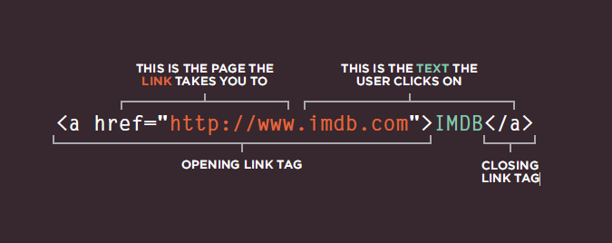
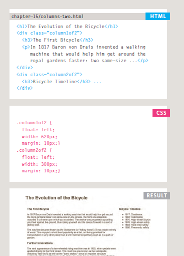
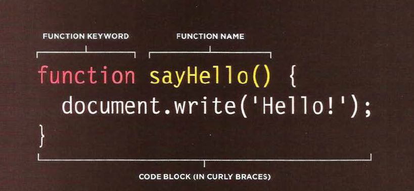

#Read4
 <h4> - HTML Links:</h4>

 - Links are created using the < a> element. Users can click on anything between the opening < a> tag and the closing < /a> tag. You specify which page you want to link to using the href attribute.

  

  - Every page and every image on a website has a URL (or Uniform Resource Locator). The URL is made up of the domain name
followed by the path to that page or image.
- |Relative Link Type |
   ---------------------
   |Same Folder:To link to a file in the same folder, just use the file name. (Nothing else is needed.) |
   |Child Folder:For a child folder, use the name of the child folder, followed by a forward slash, then the file name.|
   |Grandchild Folder: Use the name of the child folder, followed by a forward slash, then the name of the grandchild folder, followed by another forward slash, then the file name.|
   |Parent Folder:Use ../ to indicate the folder above the current one,then follow it with the file name.|
   GrandParent Folder:Repeat the ../ to indicate that you want to go up two folders (rather than one), then follow it with the file name.|

- mailto: email-links.html HTML To create a link that starts up the user's email program and addresses an email to a specified email address, you use the < a> element. However, this time the value of the href attribute starts with mailto: and is followed by the email address you want the email to be sent to.
- you want a link to open in a new window, you can use the target attribute on the opening < a> tag. The value of this attribute should be _blank. One of the most common reasons a web page author might want a link to be opened in a new window is if it points to another website. In such cases, they hope the user will return to the window containing their site after finishing looking at the other one.
- Linking to a Specific Part of the Same Page: first identify the part you need to link,use the < a> element again, but the value of the href attribute starts with the # symbol, followed by the value of the id attribute of the element you want to link to.
- linking to specific part on another page:the href attribute will contain the address for the page (either an absolute URL or a relative URL), followed by the # symbol, followed by the value of the id attribute that is used on the element you are linking to.

<h4>CSS:</h4>

- Controlling the Position of Elements positioning schemes that allow you to control the layout of a page: 
|Relative Link Type ||
   ---------------------|--------------|
| Normal flow |each block-level element sits on top of the next one. Since this is the default way in which browsers treat HTML elements, you do not need a CSS property to indicate that elements should appear in normal flow, but the syntax would be:position: static;.|
|Relative Positioning|Relative positioning moves an element in relation to where it would have been in normal flow.|
|Absolute positioning|When the position property is given a value of absolute, the box is taken out of normal flow and no longer affects the position of other elements on the page. (They act like it is not there.)The box offset properties (top or bottom and left or right)specify where the element should appear in relation to its containing element.You specify the positioning scheme using the position property in CSS You can also float elements using the float property.|
- To indicate where a box should be positioned, you may also need to use box offset properties to tell the browser how far from the top or  bottom and left or right it should be placed.
- When you use relative, fixed, or absolute positioning, boxes can
overlap. If boxes do overlap, the elements that appear later in the HTML code sit on top of those that are earlier in the page.If you want to control which element sits on top, you can use the z-index property. Its value is a number, and the higher the number the closer that element is to the front.
- The float property allows you to take an element in normal flow and place it as far to the left or right of the containing element as possible.
- The clear property allows you to say that no element (within the same containing element) should touch the left or righthand sides of a box.Many web pages use multiple columns in their design. This is achieved by using a < div> element to represent each column. The following three CSS properties are used to position the columns next to each other: width:This sets the width of the columns,float:This positions the columns next to each other, margin:This creates a gap between the columns.

- Pages can be fixed width or liquid (stretchy) layouts.
- Designers keep pages within 960-1000 pixels wide,and indicate what the site is about within the top 600 pixels (to demonstrate its relevance without scrolling).
- Grids help create professional and flexible designs.
- CSS Frameworks provide rules for common tasks.
- You can include multiple CSS files in one page.

<h4>Javascript:</h4>

- Functions let you group a series of statements together to perform a specific task. If different parts of a script repeat the same task, you can
reuse the function (rather than repeating the same set of st atements).

- calling If you are going to ask the function to perform its task later, need to give function a name. That name should describe the task it is performing.
- when you call a function that has parameters, you specify the value in parentheses thats follow its name.the values are called arguments (values or variables).
- A function declaration creates a function that you can ca ll later in your code.
- function expression: If you put a function where the interpreter would expect to see an expression, then it is treated as an expression.
- The location where you declare a variable will affect where it can be used within your code. If you declare it within a function, it can only be used within that function. This is known as the variable's scope.
- Global variables use more memory. The browser has to remember them for as long as the web page using them is loaded. Local variables are only remembered during the period of time that a function is being executed.
<address> chapter 3 from js book</address>

<h4> Pair Programming: </h4>
Pair programming touches on all four skills: developers explain out loud what the code should do, listen to others’ guidance, read code that others have written, and write code themselves.

1. Greater efficiency: both programmers can research the problem and reach a solution faster.
2. Engaged collaboration: It is harder to procrastinate or get off track when someone else is relying on you to complete the work.
3. Learning from fellow students:have different skill sets so different ways to solve problem or to understand.
4. Social skills: Pair programming not only improves programming skills, but can also help programmers develop their interpersonal skills.
5.  Job interview readiness: ompanies can get a better feel for how an applicant will fit into the team and their collaboration style.
6. Work environment readiness: Code Fellows graduates who are already familiar with how pairing works can hit the ground running at a new job.

 [Article source.](https://www.codefellows.org/blog/6-reasons-for-pair-programming/) 

