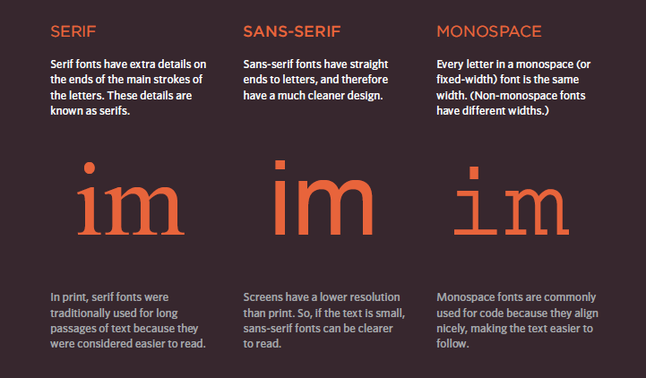
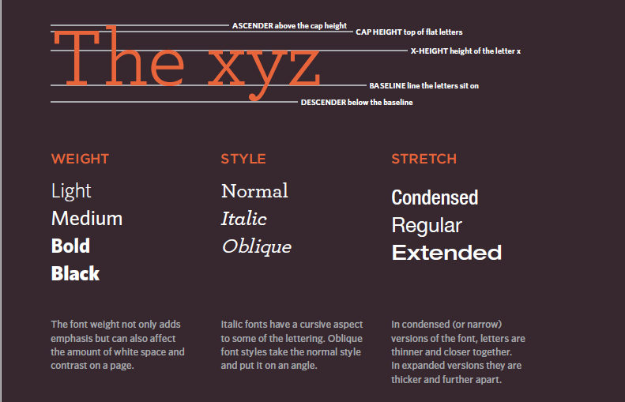
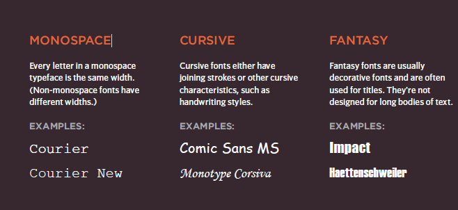
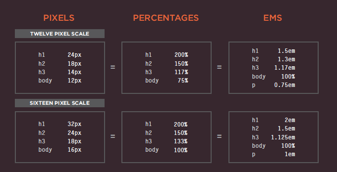
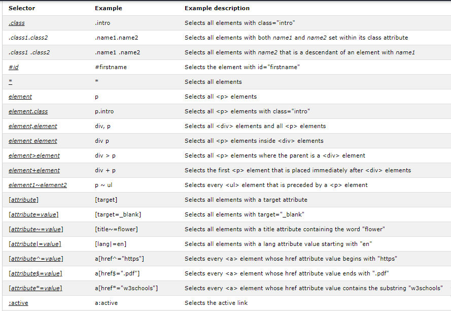

# Read5

#### Adding images:
To add an image into the page you need to use an < img> element. This is an empty element (which means there is no closing tag).

|src| This tells the browser where it can find the image file. This will usually be a relative URL pointing to an image on your own site.|
   |---------|------------|
|alt|This provides a text description of the image which describes the image if you cannot see it.|
|title| You can also use the title attribute with the < img> element to provide additional information about the image. Most browsers will display the content of this attribute in a tootip when the  user hovers over the image.|

- Block elements always appear on a new line.
- Inline elements sit within a block level element and do not start on a new line.
- The align attribute was commonly used to indicate how the other parts of a page should flow around an image (right,left,top,bootom,middle).
- The images you use on your website should be saved at the same width and height that you want them to appear on the page.

###### Rules for creating image:
- Save images in the right format.
- Save images at the right size.
- Use the correct resolution.

* < figure>  to contain images and their caption so that the two are associated.
- < figcaption> allow web page authors to add
a caption to an image.
- Photographs are best saved as JPEGs illustrations or logos that use flat colors are better saved as GIFs.

<h4> Color: </h4>

- rgb values: These express colors in terms of how much red, green and blue are used to make it up. 
- hex codes: These are six-digit codes that represent the amount of red, green and blue in a color, preceded by a pound or hash # sign.
- color names: There are 147 predefined color names that are recognized by browser.

- the background-color property sets the color of the background for that box.
- Every color on a computer screen is created by mixing amounts of red,green, and blue. To find the color you want, you can use a color picker.
- the opacity property which allows you to specify the opacity of an element and any of its child elements.
- CSS3 also allows you to specify colors as HSL values, with an optional opacity value. It is known as HSLA.

<h4>Text:</h4>
##### Fonts:
- There are several ways to use fonts. see following images:

- The font-family property allows you to specify the typeface that should be used for any text inside the element(s) to which a CSS rule applies.The value of this property is the
name of the typeface you want to use.
- pixels: are commonly used because they allow web designers very precise control over how much space their text takes up. The number of pixels is followed by the letters px.
#### Units of type size:

- The text-transform property:is used to change the case of text giving it one of the following
values:
1. uppercase: This causes the text to appear
uppercase.
2. lowercase: This causes the text to appear
lowercase.
3. capitalize:This causes the first letter of
each word to appear capitalized.

| text-decoration| |
|-------------|--------|
|none| This removes any decoration already applied to the text.|
|underline| This adds a line underneath the text.|
|overline| This adds a line over the top of the text.|
| line-through| This adds a line through words.
|blink| This animates the text to make it flash on and off.|

- The text-align: allows you to control the alignment of text. The property can take one
of four values:left,right,center,justify.
- The text-indent: allows you to indent the first
line of text within an element. The amount you want the line indented by can be specified in
a number of ways but is usually given in pixels or ems.
- The text-shadow:It is used to create a drop
shadow, which is a dark version of the word just behind it and slightly offset. It can also be used to create an embossed effect by adding a shadow that is slightly lighter than the text.The value of this property is quite complicated because it can take three lengths and a color for
the drop shadow: 
1. The first length indicates how far to the left or right the shadow should fall.
2. The second value indicates the distance to the top or bottom that the shadow should fall.
3. The third value is optional and specifies the amount of blur that should be applied to the drop
shadow.
4. The fourth value is the color of the drop shadow.

- You can specify different values for the first letter or first line of text inside an element using :first-letter and :first-line.
- :link : This allows you to set styles for links that have not yet been visited.
:visited : This allows you to set styles for
links that have been clicked on.
- Responding to Users: :hover, :active, :focus
##### Selectors:

<address> selector image source: w3school </address>

### JPEG vs PNG vs GIF: which image format to use and when?

- Use JPEG format for all images that contain a natural scene or photograph where variation in colour and intensity is smooth. Use PNG format for any image that needs transparency or for images with text & objects with sharp contrast edges like logos. Use GIF format for images that contain animations.

|JPEG| - JPEG is a lossy compression specification that takes advantage of human perception. It can achieve compression ratios of 1:10 without any perceivable difference in quality.- JPEG images don’t support transparency and are hence not usable for such cases.-JPEG images can support around 16 million colours. This is what makes them suitable for storing images of natural scenes.|
|------|------|
|PNG|- PNG is a lossless image format using DEFLATE compression. No data is lost during compression and no compression artefacts are introduced in the image.PNG images support transparency in two ways — inserting an alpha channel that allows partial transparency or by declaring a single colour as transparent (index transparency).- PNG images mainly have two modes — PNG8 and PNG24. PNG8 can support upto 256 colours whereas PNG24 can handle upto 16 million colours like a JPEG image. Use PNG8 for simple shapes with fewer colours and PNG24 for high quality, complex logos and shapes with rounded corners on a transparent background.|
|GIF|- GIF is also a lossless image format that uses LZW compression algorithm. It was favoured over PNG for simple graphics in websites in its early days because the support of PNG was still growing.-GIF images support transparency by declaring a single colour in the colour palette as transparent (index transparency).- GIF images are limited to 256 colours. If index transparency is used, then one of these 256 colours is assigned as transparent and the remaining 255 are used for other colours.|

