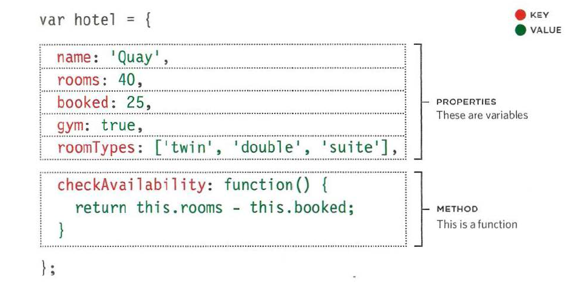
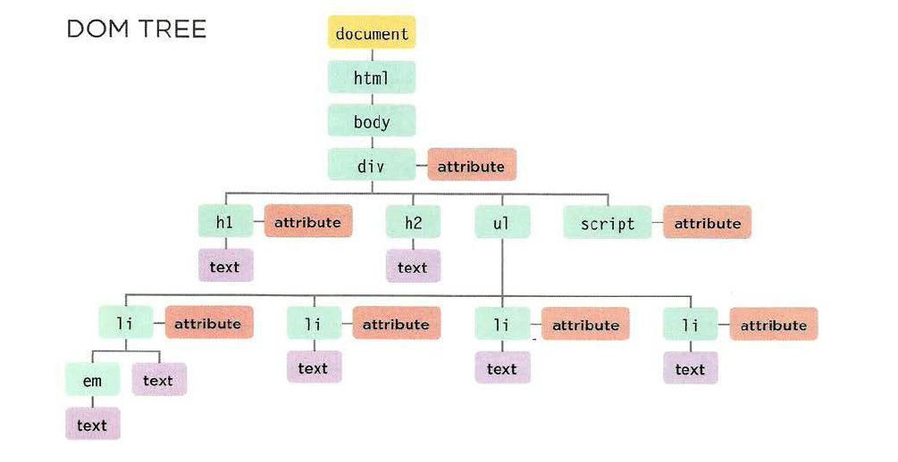

# Read6

## Understanding the problem domain is the hardest part of programming.

## Javascript:
#### Object Literals:
- Objects group together a set of variables and functions to create a model of a something you would recognize from the real world. In an  object, variables and functions take on new names.
- Like variables and named functions,properties and methods have a name and a value. In an object,that name is called a key.see example.

 

- If this site had 1,000 hotels,the only thing that would need to change would be the three properties of this object. Because we created a model for the hotel using data, the same code can access and display the details for any hotel that follows the same data model.

* Programmers use a lot of name/value pairs:
1. HTML uses attribute names and values.
2. CSS uses property names and values.
3. In JavaScript:
• Variables have a name and you can assign them a value of a string, number, or Boolean.
• Arrays have a name and a group of values. (Each item in an array is a name/value pair because it has an index number and a value.)
• Named functions have a name and value that is a set of statements to run if the function is called.
• Objects consist of a set of name/value pairs (but the names are referred to as keys).

#### Document Object Model:
- The Document Object Model (DOM) specifies how browsers should create a model of an HTML page and how JavaScript can access and update the contents of a web page while it is in the rowser window.
- As a browser loads a web page, it creates a model of that page. The model is called a DOM tree, and it is stored in the browsers' memory. It consists of four main types of nodes.

- Accessing and updating the DOM tree involves two steps:
1: Locate the node that represents the element you want to work with.
2: Use its text content, child elements, and attributes.
STEP 1: ACCESS THE ELEMENTS.
STEP 2: WORK WITH THOSE ELEMENTS.
- Methoda that find elements in the DOM tree are called DOM queries.when you need to waork with an element morw than once,you should use a variable to store the result of this query.
- DOM queries may return one element, or they may return a Nodelist,which is a collection of nodes.
- getElementByld( 1 id 1 )Selects an individual element given the value of its i d attribute .
The HTML must have an id attribute in order for it to be selectable.
- querySel ector( 1css selector ') Uses CSS selector syntax that would select one or more elements .This method returns only the first of the matching elements.
- When a DOM method can return more than one element, it returns a Nodelist (even if it only finds one matching element).
- Array syntax is prefered over the item() method because it is faster.before selecting a node from a nodelist, check that it containes nodes.hif you repeatedly use the nodelist,store it in variable.

- SELECTING ELEMENTS USING CSS SELECTORS querySelector() returns the first element node that matches the CSS-style selector. querySelectorA11 () returns a Nodelist of all of the matches.
- When you have an element node, you can select another element in relation to it using these five properties. This is known as traversing the DOM.
- Traversing the DOM can be difficult because some browsers add a text node whenever they come across whitespace between elements.
- The code below shows how you access the second text node. It will return the result:
document.getElementByid( 1 one 1 ).firstChild.nextSibling. nodeValue;
- innerText
<li id="one"><em>fresh</ em> figs</ l i>
l i - attribute
document .getElementByid('one') .textContent;
One issue with the textContent property is that Internet Explorer did
not support it until IE9. (All other major browsers support it.)
You may also come across a property called inner Text, but you should generally avoid it for three key reasons: (SUPPORT,OBEYS CSS,PERFORMANCE).
- Dom manipulation can be safer than using innerHTML.but it requires more code and can be closer.
- Using the i nnerHTML property, you can access
and amend the contents of an element,
including any child elements. 

