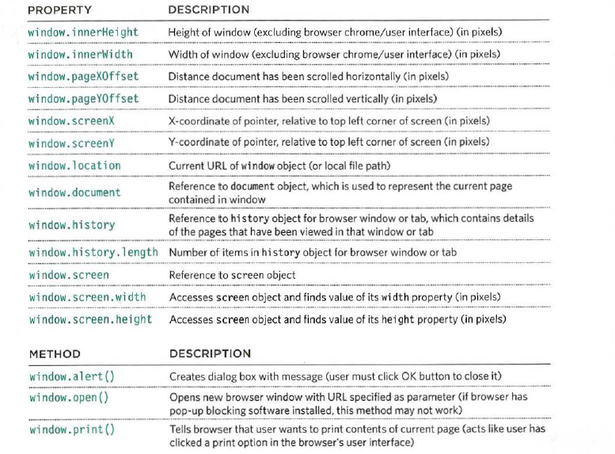

# Read7
## Domain Modeling:
- Domain modeling is the process of creating a conceptual model in code for a specific problem. A model describes the various entities, their attributes and behaviors, as well as the constraints that govern the problem domain. An entity that stores data in properties and encapsulates behaviors in methods is commonly referred to as an object-oriented model.
- To define the same properties between many objects, you'll want to use a constructor function. Below is a table that summarizes a JavaScript representation of an EpicFailVideo object.

|Property|	Data|	Type|
|--------|------|-------|
|epicRating|	1 to 10|	Number|
|hasAnimals|	true or false|	Boolean|

- his is object-oriented programming in JavaScript at its most fundamental level.
1. The new keyword instantiates (i.e. creates) an object.
2. The constructor function initializes properties inside that object using the this variable.
3. The object is stored in a variable for later use.
- Generate random numbers: example:
generateRandom = function(min, max) {
  return Math.floor(Math.random() * (max - min + 1)) + min;
}
- Here's some tips to follow when building your own domain models:

1. When modeling a single entity that'll have many instances, build self-contained objects with the same attributes and behaviors.
2. Model its attributes with a constructor function that defines and initializes properties.
3. Model its behaviors with small methods that focus on doing one job well.
4. Create instances using the new keyword followed by a call to a constructor function.
5. Store the newly created object in a variable so you can access its properties and methods from outside.
6. Use the this variable within methods so you can access the object's properties and methods from inside.

[ArticleSource](https://github.com/codefellows/domain_modeling#domain-modeling)

## HTML Tables:
- A table represents information in a grid format.
- < table> The <table> element is used to create a table. The contents of the table are written out row
by row.
- < tr> You indicate the start of each row using the opening < tr> tag.(The tr stands for table row.) It is followed by one or more < td> elements (one for each cell in that row). At the end of the row you use a closing < /tr> tag.
- < td> Each cell of a table is represented using a < td> element. (The td stands for table data.) At the end of each cell you use a closing < /td> tag.
- The < th> purpose is to represent the heading for either a column or a row. (The th stands for table
heading.)
- Spanning columns: Sometimes you may need the entries in a table to stretch across more than one column.
- Sometimes you may need the entries in a table to stretch across more than one column. The colspan attribute can be used on a < th> or < td> element and indicates how many columns that cell should run across.
- Spanning Rows: You may also need entries in a table to stretch down across more than one row. The rowspan attribute can be used on a < th> or < td> element to indicate how many rows a cell should span down the table.
- Long tables: < thead> The headings of the table should sit inside the < thead> element.
< tbody> The body should sit inside the < tbody> element.
< tfoot> The footer belongs inside the < tfoot> element.
- The border attribute was used on both the < table> and < td> elements to indicate the width of the border in pixels.
- The background color attribute was used to indicate background colors of either the entire table or individual table cells. The value is usually a hex code.

 ## JavaScript:

  #### Functions, Methods, and Objects :

- creat a new object using a combination of the new keyword and the object() constructor function.
- To update the value of properties, use dot notation or square brackets.they work on objects created using literal or constructor notation. to delete a property, use the delete keyword.
- creating many objects: sometimes you will want several objects to represent similar things.objects conrstructors can use a function as a template for creating bjects.
first,creat the template with the object's properties and methods.
- creat instances of the object using the constructor function.The new keyword followed by a call to the function creates a new object.the properties of each object are given as arguments to the function.
- The keyword this is commonly used inside functions and objects.Where the function is declared alters what this means.It always refers to one object, usually the object in which the function operates.
- In JavaScript, data is represented using name/value pairs. To organize your data, you can use an array or object to group a set of
related values. In arrays and objects the name is also known as a key.
- arrays are actually a special type of object.they hold a related set of key/value pairs (like all objects),but the key for each value is its index number.
- can combine arrays and objects to creat complex data strucures:
arrays can store a series of objects (and remember their order)objects can also hold arrays (as values of their properties).
- DOM :document object model which represents the page as a whole. its child objects represents other items on page.

- The window object represents the current browser window or tab. It is the topmost object in the Browser Object Model, and it contains other objects that tell you about the browser.

- The top most object in the Document Object Model (or DOM) is thedocument object. It represents the web page loaded into the current browser window or tab.
- Whenever you have a value that is a string, you can use the properties and methods of the String object on that value.

- Whenever you have a value that is a number, you can use the methods and properties of the Number object on it.

- The Math object has properties and methods for mathematical constants and functions.

- Once you have created a Date object, the following methods let you set and retrieve the time and date that it represents.

 <address>Sources: javascript book.</address>
