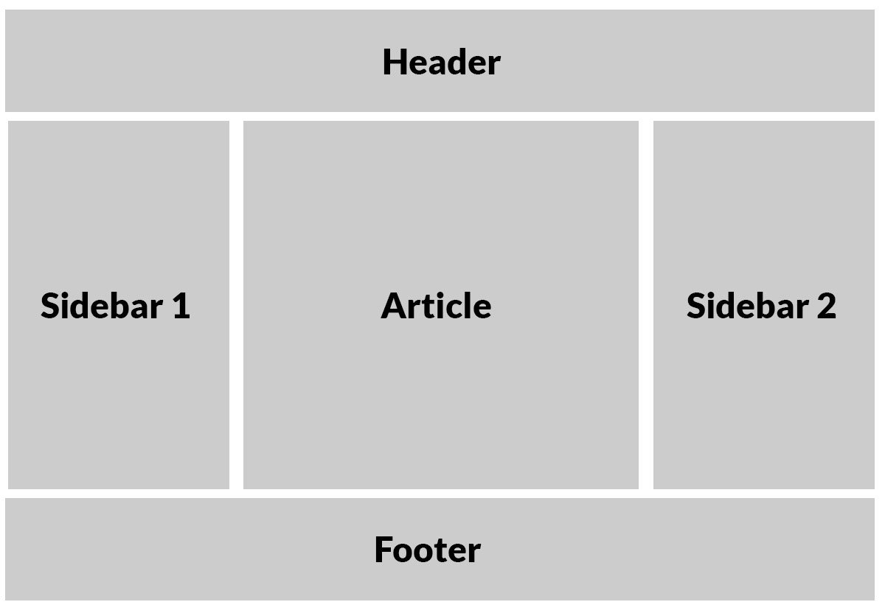

# Read8
## CSS Layout:

- Building Blocks: CSS treats each HTML element as if it is in its own box. This box will either be a block-level box or an inline box.
- Block-level elements start on a new line Examples include:< h1> < p> < ul> < li>
- Inline elements flow in between surrounding text Examples include:< img> < b> < i>
- CSS has the following positioning schemes that allow you to control the layout of a page: normal flow, relative positioning, and absolute positioning. You specify the positioning scheme using the position property in CSS. You can also float elements using the float property.
- To indicate where a box should be positioned, you may also need to use box offset properties to tell the browser how far from the top or bottom and left or right it should be placed.
- In normal flow, each block-level element sits on top of the next one. Since this is the default way in which browsers treat HTML elements, you do not need a CSS property to indicate that elements should appear
in normal flow, but the syntax would be:position: static;
- Relative positioning moves an element in relation to where it would have been in normal flow.You can indicate that an element should be relatively positioned using the position property with a value of relative.
- Fixed positioning is a type of absolute positioning that requires the position property to have a value of fixed. It positions the element in relation to the browser window.
- say that no element (within the same containing element) should touch the left or righthand sides of a box. It can take the following values:
1. left:The left-hand side of the box should not touch any other elements appearing in the same containing element.
2. right: The right-hand side of the box will not touch elements appearing in the same containing element.
3. both: Neither the left nor right-hand sides of the box will touch elements appearing in the same containing element.
4. none: Elements can touch either side.
- Many web pages use multiple columns in their design. This is achieved by using a < div> element to represent each column. The following three CSS properties are used to position the columns next to each other:
1. width: This sets the width of the
columns.
2. float: This positions the columns next
to each other.
3. margin: This creates a gap between the
columns.
A two-column layout like the one shown on this page would need two < div> elements, one for the main content of the page and one for the sidebar.
- Screen sizes: Different visitors to your site will have different sized screens that show different amounts of information, so your design needs to be able to work on a range of different sized screens.
- Screen resolution: Resolution refers to the number of dots a screen shows per inch. Some devices have a higher resolution than desktop computers and most operating systems allow users to adjust the resolution of their screens.
- PAge sizes:Because screen sizes and display resolutions vary so much, web designers often try to create pages of around 960-1000 pixels wide (since most users will be able to see designs this wide on their screens).
- Fixed Width Layouts: Fixed width layout designs do not change size as the user increases or decreases
the size of their browser window.Measurements tend
to be given in pixels.
- Liquid layout designs stretch and contract
as the user increases or decreases the size of their browser window. They tend to use percentages.
- To create a fixed width layout, the width of the main boxes on a page will usually be specified in pixels (and sometimes their height, too).
- The liquid layout uses percentages to specify the width of each box so that the design will stretch to fit the size of the screen.
- Layout Grids: Composition in any visual art (such as design, painting, or photography) is the placement or arrangement of visual elements — how they are organized on a page. Many designers use a grid structure to help them position items on a page, and the same is true for web designers.
- CSS frameworks aim to make your life easier by providing the code for common tasks, such as creating layout grids, styling forms, creating printer-friendly versions of pages and so on. You can include the CSS framework code in your projects rather than writing the CSS from scratch.
- On this page you can see the other technique for including multiple style sheets. Inside the < head> element is a separate < link> element for each style sheet.The contents of site.css are identical to styles.css on the left hand page, except the code does not contain @import rules.
- CSS Frameworks provide rules for common tasks.
- You can include multiple CSS files in one page.

[source](https://css-tricks.com/books/)