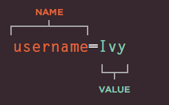
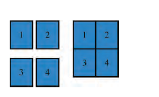
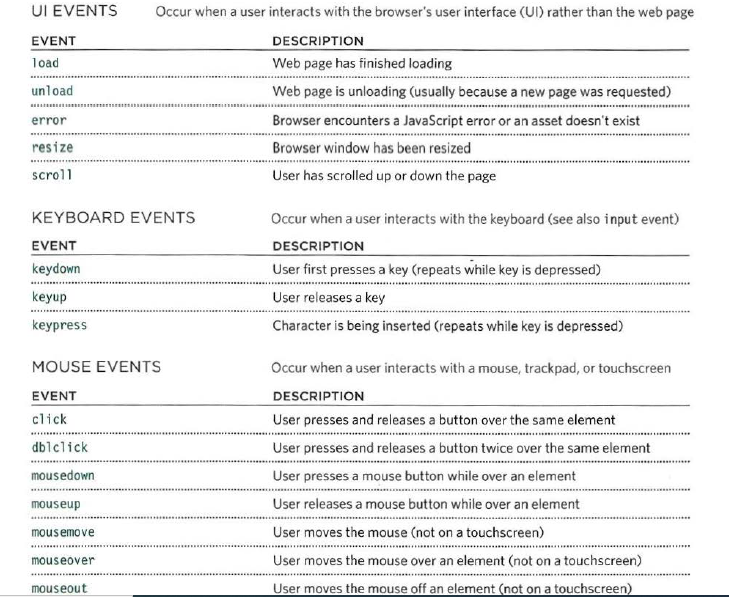
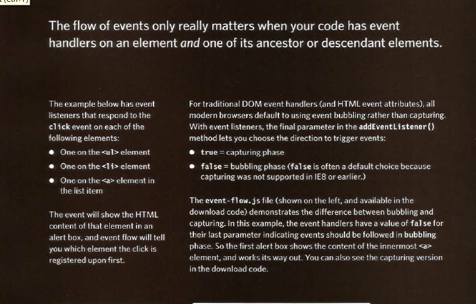

# Read9
### HTML Forms:
- There are several types of form controls that you can use to collect information from visitors to your site:
1. Adding text.
2. Making chices.
3. Submiting form.
4. Uploading files.

- A user fills in a form and then presses a button to submit the information to the server.
- form may have several form controls, each gathering different information. The server needs to know which piece of inputted data corresponds with which form element.

- Form controls live inside a < form> element. This element should always carry the action attribute and will usually have a method and id attribute too.
- action:Every < form> element requires an action attribute. Its value is the URL for the page on the
server that will receive the information in the form when it is submitted.
- The < input> element is used to create several different form controls. The value of the type attribute determines what kind of input they will be creating.
- maxlength:You can use the maxlength attribute to limit the number of characters a user may enter
into the text field. Its value is the number of characters they may enter.
- type="password":When the type attribute has a value of password it creates a text box that acts just like a single-line text input, except the characters are blocked out. They are hidden in this way so that if someone is looking over the user's shoulder, they cannot see sensitive data such as passwords
- The < textarea> element is used to create a mutli-line text input. Unlike other input elements this is not an empty element. It should therefore have an opening and a closing tag.
- < select> size You can turn a drop down select box into a box that shows more than one option by adding the size attribute. Its value should be the number of options you want to show at once.
- type="image" If you want to use an image for the submit button, you can give the type attribute a value of image. The src, width, height, and alt attributes work just like they do when used with the < img> element.
-  form validation: forms on the web that give users messages if the form control has not been filled in correctly.
### Lists, Tables & Forms:
- The list-style-type property allows you to control the shape or style of a bullet point (also 
known as a marker).
- Unordered Lists For an unordered list you can use
the following values:none,disc,circle,square.
- Ordered Lists For an ordered (numbered) list you can use the following values:decimal,decimal-leading-zero,lower-alpha,upper-alpha,lower-roman,upper-roman.
- You can specify an image to act as a bullet point using the list-style-image property.The value starts with the letters url and is followed by a pair of parentheses. Inside theparentheses, the path to the image is given inside double quotes. This property can be used on rules that apply to the < ul> and < li> elements.
- Lists are indented into the page by default and the list-styleposition property indicates whether the marker should appear on the inside or the outside of the box containing the main points.(inside,outside).
- list-style:As with several of the other CSS properties, there is a property that acts as a shorthand for list styles.

- width: to set the width of the table 
- padding to set the space between the border of each table cell and its content.
- text-transform to convert the content of the table headers to uppercase
- letter-spacing, font-size to add additional styling to the content of the table headers.
- border-top, border-bottom to set borders above and below the table headers.
- text-align to align the writing to the left of some table cells and to the right of the others background-color to change the background color of the
- alternating table rows :hover to highlight a table row when a user's mouse goes over it.
- The border-spacing property allows you to control the distance between adjacent cells .By default, browsers often leave a small gap between each table cell, so if you want to increase or decrease this space then the border-spacing property allows you to control the gap.
- Borders are collapsed into a single border where possible.(border-spacing will be ignored and cells pushed together, and empty-cells properties will be ignored.)

- Styling Text Input: font-size,color,background-color,border,border radius.
- Styling submite button: font-size,color,background-color,border,border radius,text-shadow.
- Labels for form elements are often different lengths, which means that the form controls will not appear in a straight line.
- Each row of the form has a title telling users what they need to enter. For the text inputs, the title is in the < label> element.For the radio buttons, the title isin a < span> element. Both have a class attribute with a value of title.
- The cursor property allows you to control the type of mouse cursor that should be displayed to users.

## Javascript: 
#### Events:
- Events are the browser's way of indicating when something has happened (such as when a page has finished loading or a button has been clicked).
- Here is a selection of the events that occur in the browser while you are browsing the web. Any of these events can be used to trigger a function in your JavaScript code.

- When the user interacts with the HTML on a web page, there are three steps involved in getting it to trigger some JavaScript code.Together these steps are known as event handling.
- event handling can be used to provide feedback to users filling in a registration form. It will show an error message if their username is too short.SELECT ELEMENT ,SPECiFY EVENT,call code.
- 

- The load event is commonly used to trigger scripts that access the contents of the page.
-When an event occurs on an element, it can trigger a
JavaScript function. When this function then changes
the web page in some way, it feels interactive because
it has responded to the user.
- The most commonly used events are W3C DOM
events, although there are others in the HTMLS
specification as well as browser-specific events.

 <address>Sources: javascript book.</address>
 <address>-  HTML&CSS book.</address>

